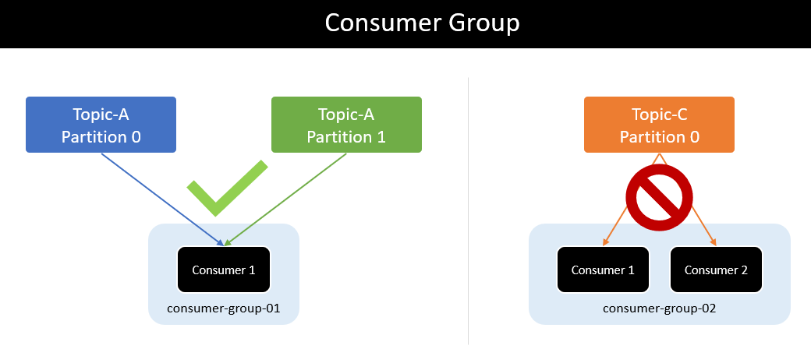
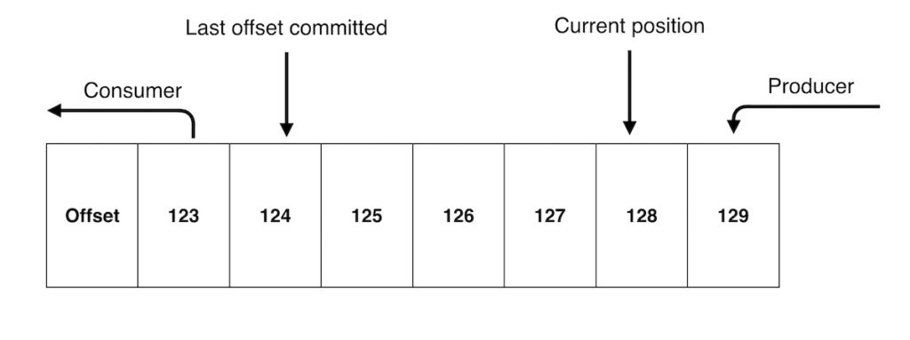

## Topic - Partition - Consumer - Producer

### Topic 

- A Topic has multiple partitions

### Partition

- A Partition consume by only one Consumer or one Consumer Group
- Messages are arranged in the order of a Partition

### Producer

#### Send mesage without specify the partition number
- The Producer will use the mechanism round-robin
- The first message will send to Broker_1
- The second message will send to Broker_2

#### How to control messages go to the Partition
- Append a unique key for each message	
- Specify a partition number for each message
- Custom routing to partition by logic

#### How to the Producer know a message sent successfully
- <pre>acks: 0   => without waiting the response</pre>
- <pre>acks: 1   => wating the response from Leader</pre>
- <pre>acks: all => waiting the response form Leader and IRS</pre>

### Consumer 

- A Consumer can consume messages from multiple partitions in a Topic 
- A Consumer read messages orderly

## Consumer Group
- A Consumer Group will read and delivery to consumers in this group. 
- A consumer Group will balance number consumer. 

## Reference Links
- [Link 1](https://docs.confluent.io/kafka/design/index.html)
- [Link 2](https://www.conduktor.io/blog/how-replication-and-isr-work-in-kafka)
- [Link 3](https://docs.confluent.io/kafka/design/replication.html)